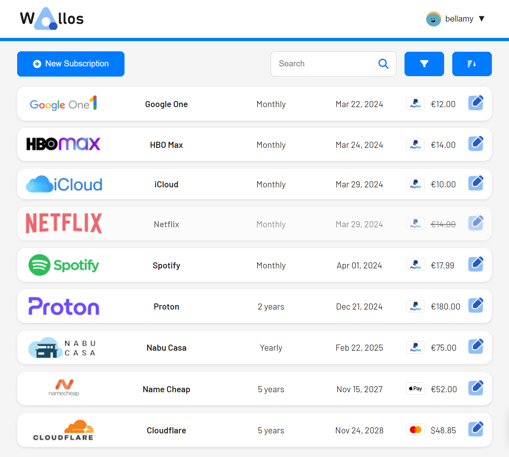

<!--
注意：此 README 由 <https://github.com/YunoHost/apps/tree/master/tools/readme_generator> 自动生成
请勿手动编辑。
-->

# YunoHost 上的 Wallos

[](https://ci-apps.yunohost.org/ci/apps/wallos/)


[](https://install-app.yunohost.org/?app=wallos)

*[阅读此 README 的其它语言版本。](./ALL_README.md)*

> *通过此软件包，您可以在 YunoHost 服务器上快速、简单地安装 Wallos。*  
> *如果您还没有 YunoHost，请参阅[指南](https://yunohost.org/install)了解如何安装它。*

## 概况

Wallos is a powerful, open-source, and self-hostable web application designed to empower you in managing your finances with ease. Say goodbye to complicated spreadsheets and expensive financial software – Wallos simplifies the process of tracking expenses and helps you gain better control over your financial life.


**分发版本：** 2.48.0~ynh1

**演示：** <https://demo.wallosapp.com>

## 截图



## 文档与资源

- 上游应用代码库： <https://github.com/ellite/Wallos>
- YunoHost 商店： <https://apps.yunohost.org/app/wallos>
- 报告 bug： <https://github.com/YunoHost-Apps/wallos_ynh/issues>

## 开发者信息

请向 [`testing` 分支](https://github.com/YunoHost-Apps/wallos_ynh/tree/testing) 发送拉取请求。

如要尝试 `testing` 分支，请这样操作：

```bash
sudo yunohost app install https://github.com/YunoHost-Apps/wallos_ynh/tree/testing --debug
或
sudo yunohost app upgrade wallos -u https://github.com/YunoHost-Apps/wallos_ynh/tree/testing --debug
```

**有关应用打包的更多信息：** <https://yunohost.org/packaging_apps>
